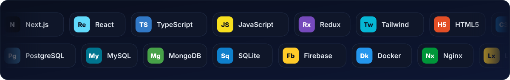
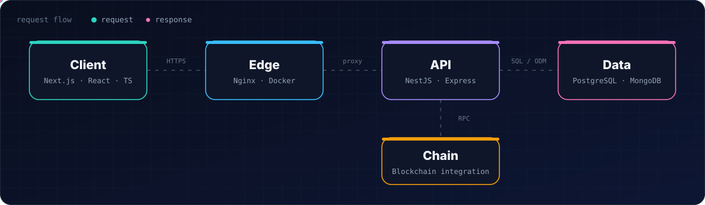

 

&nbsp;

  

 

 

 

 

<picture>
  <source media="(prefers-color-scheme: dark)" srcset="https://raw.githubusercontent.com/santhu-ops/santhu-ops/output/github-snake-dark.svg" />
  <source media="(prefers-color-scheme: light)" srcset="https://raw.githubusercontent.com/santhu-ops/santhu-ops/output/github-snake.svg" />
  
</picture>

 

 

 

&nbsp;

  

